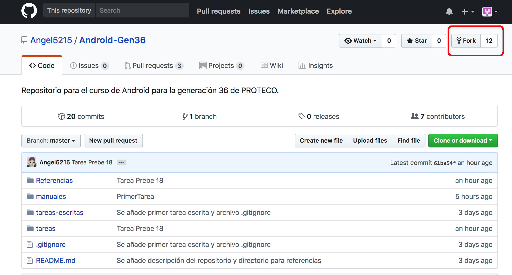

# Práctica 1. Uso de Git y GitHub

Esta práctica tiene como objetivo que comprendas lo básico para el uso de Git y GitHub.

Es probable que hayas realizado ya un pull request. Si es tu caso, has primero las instrucciones del paso 6 (no deberás hacerlas de nuevo después) y luego continúa con las del paso 3 hasta el 5. Recuerda, si tienes dudas envíame un mensaje de correo.

## 1. Fork del repositorio principal

Entrarás al repositorio principal: [Android-Gen36](https://github.com/Angel5215/Android-Gen36). Lo primero que debes hacer es copiar este repositorio a tu espacio personal (hacer un *fork*). Para esto, deberás oprimir el botón **Fork** en la parte superior derecha del repositorio principal.



## 2. Clonar el repositorio

Clonar el repositorio. Este paso se realiza para que tengas una copia del repositorio en tu computadora y puedas trabajar con él localmente.

Estas instrucciones las debes realizar desde una interfaz de línea de comandos (terminal). Por ejemplo, si tu nombre de usuario es `alumno01` tendrás que hacer algo como:

```bash
# Nota cómo el clon se realiza de tu fork, no del repositorio principal.
$ git clone https://github.com/alumno01/Android-Gen36
```

Este comando traerá una copia del repositorio a tu computadora desde el cual podrás trabajar.

Al haber clonado el repositorio, se creará un directorio en el lugar donde lo clonaste llamado `Android-Gen36`. Entra a ese directorio

```bash
$ cd Android-Gen36
```

## 3. Crear archivos.

Entra a la carpeta `practicas` y crea un archivo de texto con tu número de prebecario `XX.txt` y que tenga como contenido tu nombre completo.

```bash
$ cd practicas
$ echo "[TU NOMBRE COMPLETO]" > XX.txt
```

Si usas el comando `git status` podrás ver que Git aún no sabe qué hacer con el archivo que acabas de crear.

## 4. Agrega tu archivo y envíalo al servidor

Indica a Git que vas a agregar el archivo que creaste:

```bash
$ git add XX.txt
```

Crea un commit. Recuerda darle una descripción adecuada.

```bash
$ git commit -m 'Agrego archivo de la primer práctica.'
```

Git es un sistema de control de versiones. Esto significa que tus cambios están registrados en la historia de Git, pero únicamente en tu computadora. Para enviarlos a GitHub, basta con que los "*empujes*" o "*publiques*" en el servidor:

```bash
$ git push
```

## 5. Notifica tus cambios con un pull request.

Si lograste llegar hasta aquí es porque tus cambios ya están publicados en GitHub. Sin embargo, aún no hemos acabado. Todos tus cambios están publicados pero solo en tu copia del repositorio (el fork), yo aún no sé nada sobre tus cambios. 

Al centro de la pantalla podrás ver una leyenda que dice *This branch is 1 commit ahead of Angel5215/Android-Gen36* o algo similar. Esto significa que estás adelantado al repositorio central.

En esa misma línea, del lado derecho verás un botón **Pull request**. Al darle click, GitHub te mostrará un resumen de las diferencias entre mi versión y la tuya. Si te parece correcta, te permite seleccionar un botón verde, **Create pull request**.

Al darle click deberás describir los cambios que hiciste y confirmar tu mensaje. GitHub te mostrará que la solicitud ha sido creada.

Con esto, has logrado entregar la práctica. Ahora es mi turno de revisar los cambios y aceptarlos.

## 6. Configurar tu copia local para seguir al repositorio raíz.

A lo largo de este curso seguiremos usando este repositorio. Para poder actualizar el repositorio con las instrucciones relevantes, es decir, cuando haya nuevas tareas, prácticas, proyectos, etcétera. **Te recomiendo indicarle que estarás siguiendo una rama remota**:

```bash
# Este comando va en el directorio de tu copia local del repositorio
$ git remote add --track master Angel5215 git://github.com/Angel5215/Android-Gen36
```

Esta línea significa que agregarás una fuente remota en la dirección mencionada, siguiendo la rama maestra, y le darás el nombre local de `Angel5215`.

Has una prueba. En el directorio de la copia local de tu repositorio:

```bash
$ git pull Angel5215 master
```

Esta instrucción significa: trae la rama principal del repositorio remoto `Angel5215`. Cuando vuelvas a comenzar a trabajar con tu repositorio, recuerda hacer esto para sincronizar con los últimos cambios que yo haya publicado. 