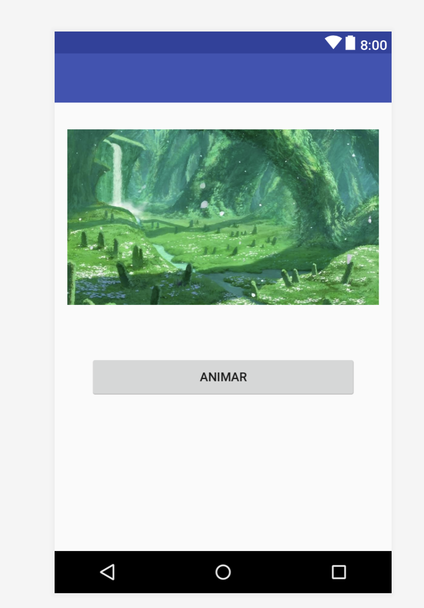

# Tarea 02.

Este es el espacio para que agreguen su tarea número 2.

## Ejercicio 1.

Aprenderán a agregar dependencias en Android Studio. En este caso investigarán cómo usar **AndroidViewAnimations**.

En su proyecto, en el archivo `activity_main.xml`, usando `RelativeLayout` o `LinearLayout`, colocarán una interfaz similar a la siguiente:

Al dar click al botón animar, la imagen debe realizar alguna animación. Investigar cómo hacer esto con **Android View Animations**.

## Ejercicio 2.

En otra aplicación, recrearán la vista del reproductor de Spotify usando `LinearLayout` o `RelativeLayout`.

